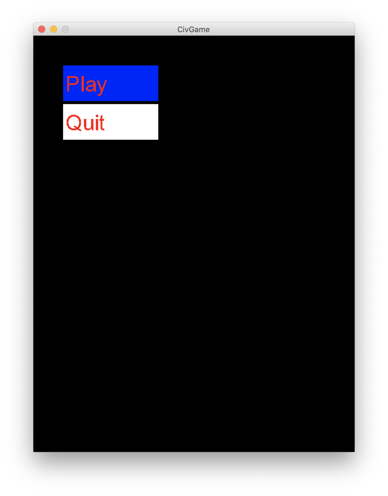
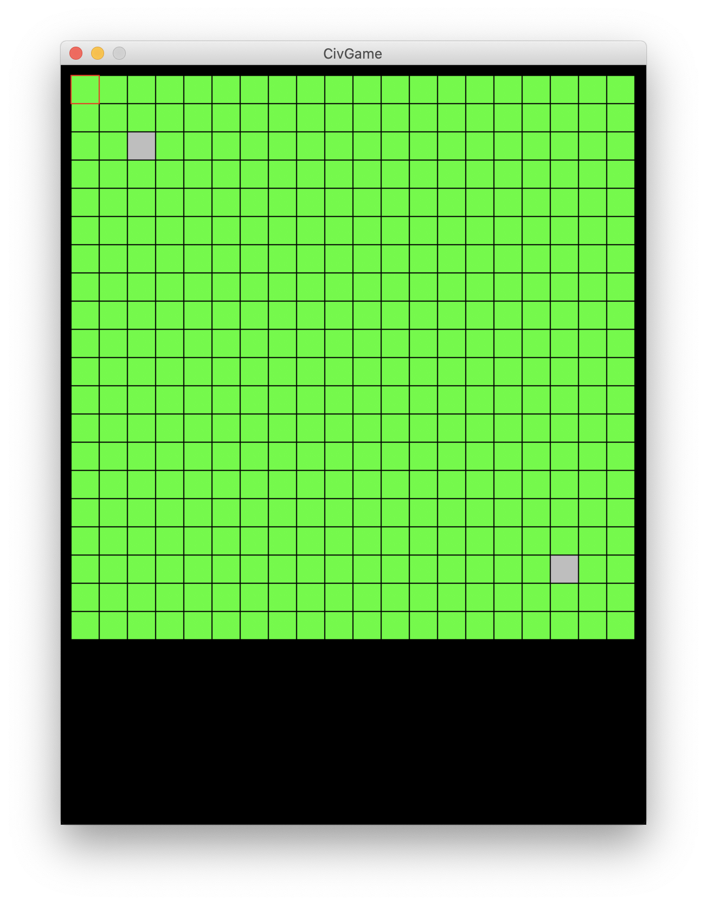
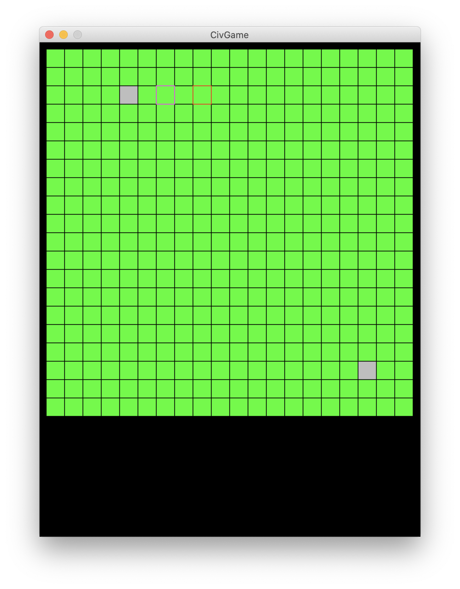

# Civ Game

Этот проект состоит из серверной части и части клиента (для самой игры).

### Установка и запуск

#### Установка

1. Нужно склонировать этот репозиторий
2. Создать и активировать виртуальное окружение
3. Скачать нужные для игры пакеты ```pip install -r requirements.txt```

#### Запуск

Для запуска сервера нужно прописать команду
```bash
python server.py <host> <port>
```

Для запуска клиента(игры) нужно прописать команду
```bash
python client.py <host> <port>
```

### Основной функционал

Упраление в игре исключительно клавишами вверх, вниз, вправо, влево, enter, space, esc

На данный момент в игре можно подключиться к серверу,
и при подключении к серверу второго пользователя откроется меню игры



После этого можно вырать вкладку Play, и появится черный экран до появления
второго пользователя в этой игре. Как только он подсоединится, появится игровое меню



Здесь выбранная клетка выделяется красным контуром
- Клетка земли - зеленая клетка
- Клетка монетки - желтая клетка
- Клетка с Юнитом - серая клетка

Если нажать на space, то клетка выделится как выбранная.



Если нажать второй раз, то:
1. Если выбранная клетка была с юнитом, то юнит передвинется на новую клетку
2. Если выбранная клетка была без юнита, то выбор просто уберется

Все действия происзодят синхронно и у другого пользователя 
(ваши передвижения видны ему, его передвижения видны вам)

Таким образом вы можете передвигать юниты как в настоящей мультиплеерной игре)

### Пример запуска

Сервера:
```bash
python server.py '127.0.0.1' 9010
```

Клиента:
```bash
python client.py '127.0.0.1' 9010
```

Для закрытия сервера нужно нажать в консоли с запущенным сервером ```ctrl + c```
